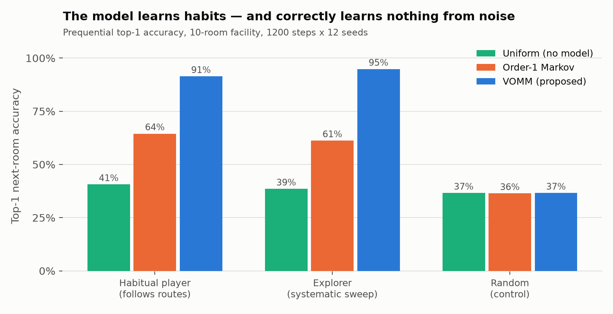
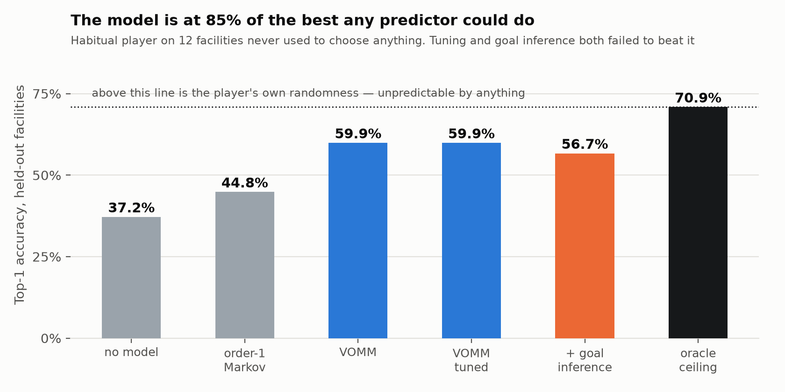
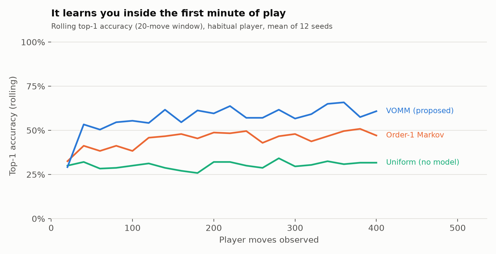
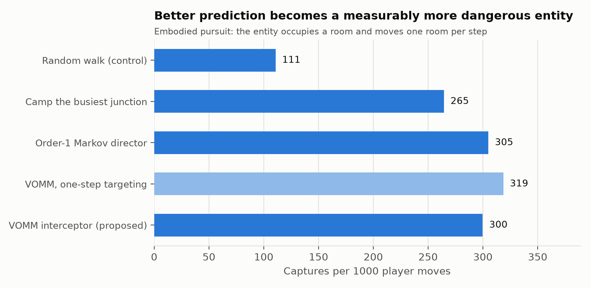
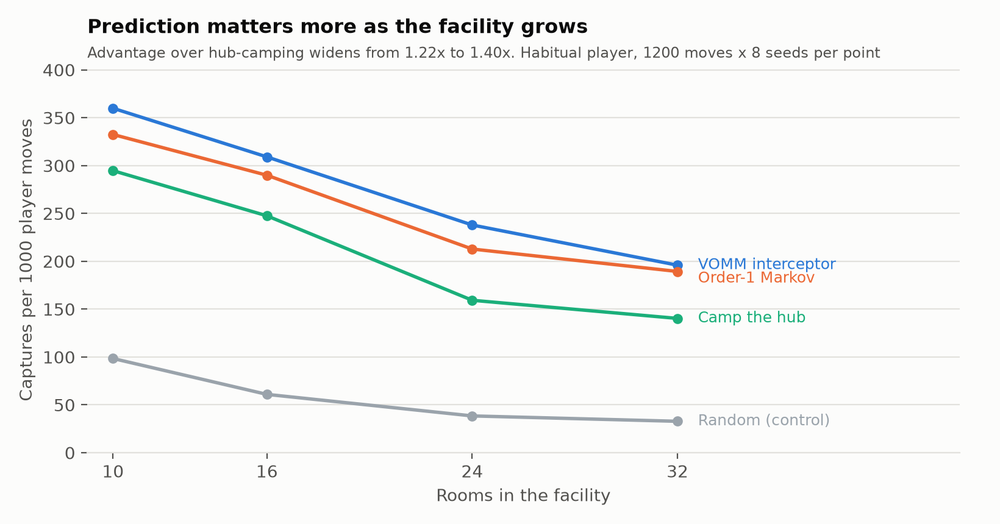
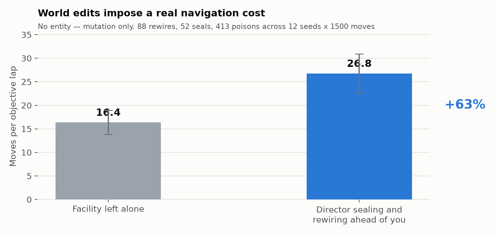
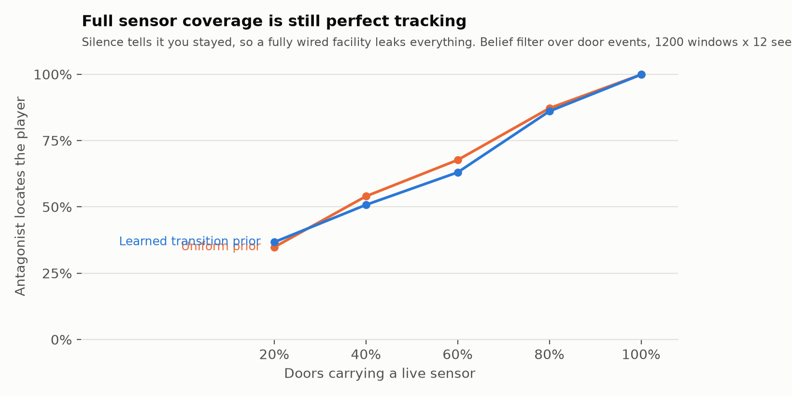
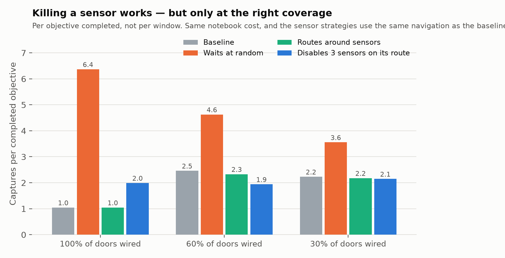
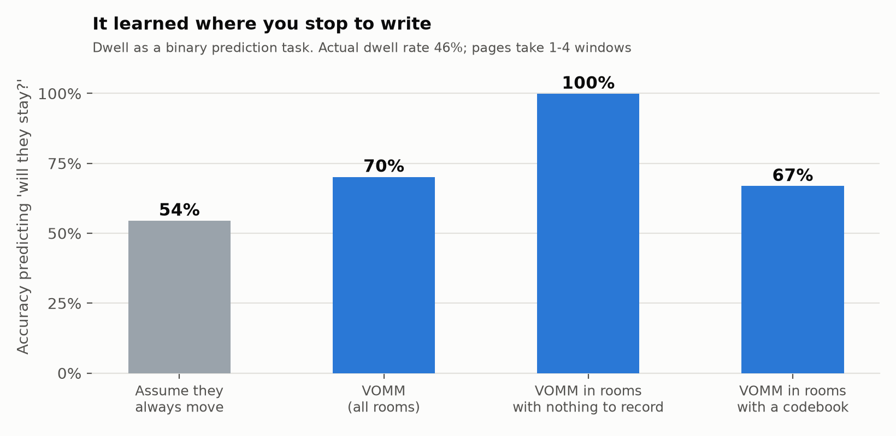
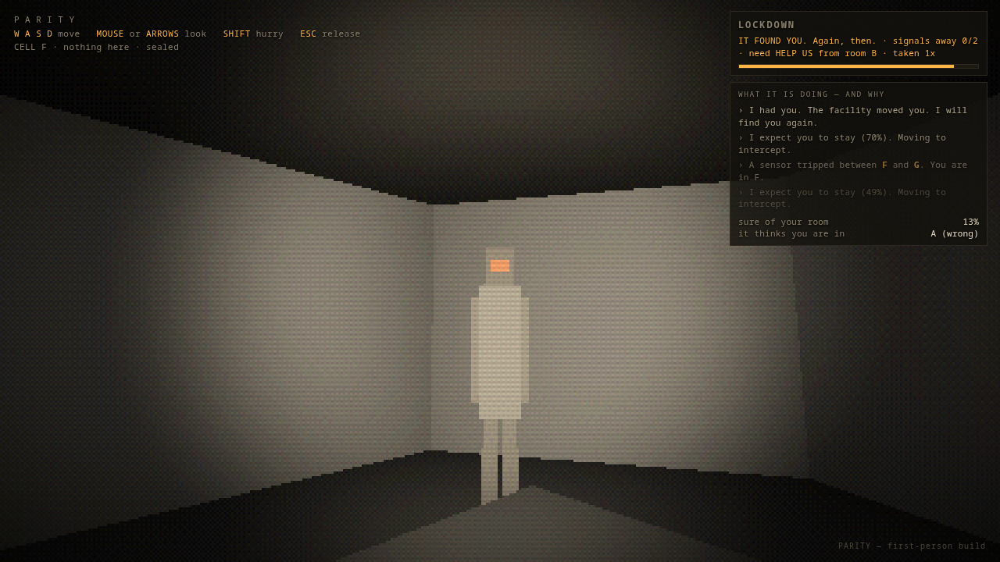

# PARITY
## An Adaptive Horror Game Driven by Online Player-Trajectory Prediction

**Project Review III — Progress Report**
Shivam Kumar · Vellore Institute of Technology · 16 September 2026

---

## 1. Domain and Problem Statement

### 1.1 Domain

Game AI has largely optimised for *competence* — agents that play well. A separate
and less-solved problem is **adaptation**: systems that model the individual player
and reshape the experience around them. This sits at the intersection of three
areas: player modelling (inferring player state and intent from behavioural
telemetry), adaptive game AI and dynamic difficulty adjustment (acting on that
inference), and procedural content generation (changing the world itself rather
than only the agents in it).

Horror is the genre where this matters most, and where it is least explored.
Horror depends on *uncertainty*. Every horror game degrades as the player learns
it: routes get memorised, spawn points get learned, and the monster becomes a
timing puzzle. The genre's central failure mode is that mastery destroys the
product.

### 1.2 Problem Statement

> Existing horror antagonists are **static or randomised**. Static AI is learnable
> and stops being frightening. Randomised AI is unlearnable and therefore reads as
> unfair rather than intelligent. Neither adapts to the specific player.
>
> **PARITY** proposes a third option: an antagonist that builds an **online
> behavioural model of the individual player** and acts on its predictions —
> intercepting where the player is going rather than chasing where they are, and
> degrading the information the player has come to depend on.

### 1.3 Why this is a hard and interesting problem

1. **Cold start.** A commercial ML pipeline trains offline on a corpus. A horror
   antagonist must be interesting in the *first* two minutes, against a player it
   has never seen, with no pre-collected data for that individual.
2. **Legibility.** A model the player cannot perceive is, to the player, no model
   at all. The adaptation must be *felt* without being announced.
3. **Fairness.** An adaptive antagonist that is merely stronger is not scarier, it
   is unfair. The system needs explicit constraints that keep it defeatable.
4. **Evaluation.** "Is it scary?" is not measurable at the scale a solo project can
   playtest. The project needs proxy metrics that can be computed headlessly.

### 1.4 Aim and Objectives

**Aim:** Build a first-person horror game in which the antagonist's behaviour is
driven by a live, per-player predictive model, and demonstrate quantitatively that
the model both learns and *matters*.

| # | Objective | Status |
|---|---|---|
| O1 | Formalise the facility as a mutable room graph with runtime topology edits | Done |
| O2 | Implement an online next-room predictor that learns from the first move | Done |
| O3 | Show it beats a no-model control and an order-1 Markov baseline | Done |
| O4 | Show it learns *nothing* from a random player (no leakage) | Done |
| O5 | Show better prediction yields a measurably more dangerous antagonist | Done |
| O6 | Make the model legible to the player in-game | Demo built |
| O7 | Ship the first-person Godot vertical slice | In progress |

---

## 2. Literature Review

Twenty-two works, twenty of them from 2023 or later, grouped by the question they
answer for this project.

### 2.1 Player modelling and behaviour prediction

| # | Work | Year | Relevance to PARITY |
|---|---|---|---|
| 1 | Lin et al., *Open Player Modeling: The Open Player Socially Analytical Intelligence Architecture* — arXiv:2603.26915 | 2026 | Argues player models should be inspectable rather than hidden; directly motivates our in-game prediction overlay and death readout. |
| 2 | Dehpanah et al., *Player Modeling using Behavioral Signals in Competitive Online Games* — arXiv:2112.04379 | 2021 | Establishes that raw behavioural signals alone support useful player models — no questionnaires or biometrics needed. |
| 3 | Carlier et al., *Personalization in Serious Games and Gamification for Healthcare* — arXiv:2411.18500 | 2024 | Three-tier taxonomy of personalisation (model / method / adaptation) that our Telemetry–Predictor–Director split mirrors. |
| 4 | Halina et al., *Representing and Generating Levels Over Time through Playtrace Reconstructive Partitioning* — arXiv:2607.12097 | 2026 | Uses playtraces as the primary representation of a level — the same premise as modelling the facility through the player's path. |
| 5 | Bazzaz, *Player Perceptions of Generative AI in Games: A Steam Review Analysis* — arXiv:2608.11539 | 2026 | Evidence on how players actually react to AI-driven systems; informs how openly PARITY should surface its model. |

### 2.2 Adaptive game AI and dynamic difficulty adjustment

| # | Work | Year | Relevance to PARITY |
|---|---|---|---|
| 6 | Romeo et al., *NTRL: Encounter Generation via Reinforcement Learning for DDA in Dungeons and Dragons* — arXiv:2506.19530 | 2025 | Closest analogue: adapts *encounters* rather than agent stats. PARITY adapts encounter placement via prediction instead of RL. |
| 7 | Lopes et al., *Closing the Loop in Affect-Driven Game Adaptation: A Systematic Review* — arXiv:2505.01351 | 2025 | Survey of the affect-adaptation loop; identifies evaluation as the field's weak point — the gap our headless bot harness addresses. |
| 8 | Cafri et al., *Dynamic Difficulty Adjustment With Brain Waves* — arXiv:2504.13965 | 2025 | Represents the biometric branch of DDA. We deliberately avoid biometrics: behaviour alone, no extra hardware. |
| 9 | Fuchs et al., *Personalized Dynamic Difficulty Adjustment — Imitation Learning Meets Reinforcement Learning* — arXiv:2408.06818 | 2024 | Learns to imitate an individual player, then adapts. Same personalisation goal; far heavier training requirement than ours. |
| 10 | McConnell et al., *From Frustration to Fun: An Adaptive Problem-Solving Puzzle Game Powered by Genetic Algorithm* — arXiv:2509.23796 | 2025 | Evolutionary adaptation of content difficulty; a design-space alternative to our utility-scoring Director. |
| 11 | Jarma Montoya et al., *Atari Games Challenge: Multimodal Player Experience Assessment* — arXiv:2605.27261 | 2026 | Multimodal experience measurement; the evaluation vocabulary for the later playtest milestone. |
| 12 | Tripathi et al., *AI-Enabled Serious Games: Integrating Intelligence and Adaptivity in Training Systems* — arXiv:2605.21962 | 2026 | Architectural patterns for embedding adaptive intelligence in a game loop. |

### 2.3 Procedural generation of mutable levels

| # | Work | Year | Relevance to PARITY |
|---|---|---|---|
| 13 | Fiuza Vieira et al., *A Novel Procedural Generation for Level Design of Mansions and Dungeons* — arXiv:2606.03857 | 2026 | Graph-based generation of exactly our building type; informs the room-graph generator and connectivity guarantees. |
| 14 | Özkan, *Procedural Game Level Design with Deep Reinforcement Learning* — arXiv:2510.15120 | 2025 | RL-driven level construction; contrasts with our constraint-checked mutation approach. |
| 15 | Earle et al., *Video Game Level Design as a Multi-Agent Reinforcement Learning Problem* — arXiv:2510.04862 | 2025 | Treats level design as multi-agent decision-making — the framing behind our Director editing the level at runtime. |

### 2.4 Sequence and next-location prediction (methodological core)

| # | Work | Year | Relevance to PARITY |
|---|---|---|---|
| 16 | Begleiter, El-Yaniv & Yona, *On Prediction Using Variable Order Markov Models*, JAIR 22:385–421 — arXiv:1107.0051 | 2004 | **Foundational.** The formal treatment of VOMM prediction our model implements, including back-off/interpolation behaviour. |
| 17 | Wu et al., *Beyond Regularity: Modeling Chaotic Mobility Patterns for Next Location Prediction* — arXiv:2509.11713 | 2025 | Directly analogous task — next-location prediction over a discrete place graph — and handles the irregular case our noisy player represents. |
| 18 | Deng et al., *STRelay: A Universal Spatio-Temporal Relaying Framework for Location Prediction* — arXiv:2508.16620 | 2025 | State-of-the-art trajectory prediction architecture; the natural upgrade path from VOMM in the stretch milestone. |
| 19 | Liu et al., *Mixture-of-Experts for Personalized and Semantic-Aware Next Location Prediction* — arXiv:2505.24597 | 2025 | Per-individual personalisation of location prediction — the same personalisation axis PARITY needs. |
| 20 | Soni et al., *Can We Predict Your Next Move Without Breaking Your Privacy?* — arXiv:2507.08843 | 2025 | Privacy framing for behavioural trajectory models; relevant because PARITY persists a per-player model across sessions. |

### 2.5 Fear and horror as a measurable experience

| # | Work | Year | Relevance to PARITY |
|---|---|---|---|
| 21 | Zhang et al., *VRMN-bD: A Multi-modal Natural Behavior Dataset of Immersive Human Fear Responses* — arXiv:2401.12133 | 2024 | Evidence that fear responses are detectable in ordinary behavioural signals — supports using movement telemetry as a tension proxy. |
| 22 | Zhang et al., *Decoding Fear: Exploring User Experiences in Virtual Reality Horror Games* — arXiv:2312.15582 | 2023 | Qualitative account of what actually frightens players; sources the design constraint that unfairness destroys fear. |

### 2.6 Research Gap

Across these works, three gaps are consistent:

1. **DDA adapts parameters, not position.** The literature overwhelmingly tunes
   difficulty *magnitude* (enemy health, encounter budget, puzzle complexity).
   Almost none adapt *where the antagonist chooses to be* from a predictive model
   of the individual player.
2. **Next-location prediction is not used adversarially.** Trajectory prediction is
   mature (§2.4) but is applied to service delivery and urban analytics. Its use as
   a real-time adversary against the person being predicted is unexplored.
3. **Adaptation is invisible and therefore unevaluated.** Lopes et al. (2025)
   identify evaluation as the field's weak point. Adaptive systems are rarely made
   legible to the player or measured against a no-model control.

**PARITY addresses all three:** it applies online trajectory prediction
adversarially, adapts antagonist *placement* and *world state* rather than
parameters, and evaluates against explicit controls with the model surfaced on
screen.

---

## 3. Proposed Methodology

### 3.1 Formalisation

The facility is an undirected graph `G = (V, E)`: rooms are vertices, doors are
edges. The player occupies a vertex and moves along edges, producing a trajectory
`h = (v₁, v₂, …, vₜ)`.

**The clock.** The facility runs on a single shared cycle: lockdown, then a short
window in which every door unlocks, then lockdown again. Decisions happen only at
windows. During lockdown the player is sealed in place — which is when they draw in
the notebook, copy a codebook, or stage the outgoing register. Drawing is real-time,
so an open door and an unfinished page compete for the same seconds.

**Prediction task.** At each window the player chooses a door *or declines to move*.
Given trajectory `h`, estimate

> `P(v_{t+1} = c | h)` for each `c ∈ N(vₜ) ∪ {vₜ}`

**Staying is a first-class action, not the absence of one.** Including `vₜ` in the
candidate set is what makes dwell predictable at all — and dwell is highly
informative, because a player lingers where there is something to record. The
antagonist is bound by the same clock: it also acts only at windows, so lockdown is
genuinely safe and all the danger concentrates at the moment the doors open.

**Why a variable-order model is required.** An order-1 Markov model conditions only
on `vₜ`. But real players run *routes*, so the same room has different successors
depending on how it was entered. In our test facility, room D appears five times in
a habitual player's circuit with four different successors — order-1 is
structurally incapable of separating them. Conditioning on longer context resolves
it, but long contexts are sparse. A **variable-order Markov model with back-off**
resolves both pressures at once.

### 3.2 The model

For each context length `o = 0 … k` (the last `o` rooms), interpolate from the
longest available context down to uniform:

```
P_o(x | ctx) = w · f_o(x | ctx) + (1 − w) · P_{o−1}(x | ctx[1:])
w            = C(ctx) / (C(ctx) + α)
```

where `f_o` is the empirical frequency, `C(ctx)` the times that context was
observed, and `α` a smoothing constant (α = 1.6, k = 4). Long contexts dominate
once well-supported and decay gracefully when not — Witten-Bell style
interpolation, following Begleiter et al. (2004).

**Properties that matter for this application:**

- **Learns online from the first move** — no pre-training corpus, solving cold start.
- **Persists across runs** — the model carries between deaths; the player's notebook does too.
- **Inspectable** — every prediction decomposes into "context → outcome, n observations",
  which is what makes the death readout and overlay possible.
- **Cheap** — hash-map counter updates, negligible per-frame cost.

### 3.3 Separating belief from behaviour

The **Predictor** outputs beliefs. The **Director** decides what to do with them,
scoring each counter-move by *expected disruption × confidence*:

| Counter-move | Trigger |
|---|---|
| Intercept | High confidence on a specific room — move to meet the player there |
| Rewire / rotate | High confidence on a transit route — change it before they reach it |
| Poison a codebook | A recorded lookup entry the player is predicted to need again |
| Seal a shortcut | An edge with high traversal frequency |

This separation means the model can be upgraded (VOMM → GRU → STRelay-style
architecture) without re-tuning game feel, and game feel can be tuned without
touching the model.

### 3.4 Fairness constraints

An adaptive antagonist must remain defeatable, or the result is unfairness rather
than fear (§2.5). Three hard invariants:

1. **No mutation is ever applied to anything currently visible to the player.**
2. **Confidence gating** — below a confidence threshold the antagonist hunts
   conventionally instead of intercepting. It only exploits what it actually knows.
3. **Solvability invariant** — every topology mutation is checked for graph
   connectivity and objective reachability, and reverted if it would soft-lock the
   run. Both mutation operators revert any edit that fails this check, and the
   property is asserted over 25 generated facilities in the invariant suite (§5.9).

Notably, **no signal is emitted when sabotage occurs.** The player's hand-kept
notebook is the only means of detecting it. Sabotage nonetheless lands almost
exclusively on recorded information — not as a concession, but because poisoning an
unrecorded codebook disrupts nothing, so a utility-maximising Director never spends
a move on it. The fairness is emergent, not announced.

### 3.6 Partial observation: sensing through door events

The antagonist originally observed the player's position perfectly. That turned out
to be the reason waiting was not a defence (§5.7), so this cycle replaced it.

Doors carry motion detectors, and a fraction of them are live — some the facility
never wired, some the player has spent a dangerous task to silence. The antagonist
observes one thing per window: which door, if any, tripped. It maintains a belief
over rooms and updates it with a forward filter:

```
predict   b'(c) = sum_r b(r) * T(r -> c)
update    zero any state inconsistent with the evidence, renormalise
```

| Evidence | What it rules out | Effect |
|---|---|---|
| Door (a,b) tripped | Everything except a crossing of that door | Collapses to near-certainty |
| Silence | Any crossing of a **wired** door | Keeps staying put and unwired crossings |
| Co-location | Everything else | Collapses to certainty |

Silence is the interesting case: it is ambiguous between "they held position" and
"they used a door I cannot hear", and that ambiguity is what gives the player
something to exploit. One consequence is worth stating plainly, because it is
counter-intuitive: **if every door is wired, silence proves the player stayed**, so
full coverage is still perfect tracking. Partial observation only exists because
coverage is incomplete.

### 3.5 Evaluation protocol

Human playtesting does not scale to a solo project, so evaluation is **headless and
bot-driven**. Three scripted players stand in for humans:

- **HabitualBot** — runs a fixed objective circuit (models a player who has learned the level)
- **ExplorerBot** — systematic least-recently-visited sweep (models a first-time player)
- **EvasiveBot** — pursues the same objectives but declines 35% of windows on purpose,
  to desynchronise from anything modelling it (**the counter-play**)
- **RandomBot** — uniform over doors *and staying* (**the control**: no habit at all)

All accuracy is measured **prequentially** — every prediction is made before its
outcome is observed, so there is no train/test leakage by construction.

**The control is the most important experiment.** Against RandomBot the model must
*fail* to beat baseline. A model that appears to predict a random walk is measuring
something it should not have access to.

---

## 4. Module Description and System Design

### 4.1 Architecture

Eight modules across three layers. The simulation core has no rendering dependency
and is unit-testable in isolation.

```
                 ┌──────────────────────────────────────────┐
   player input  │            SIMULATION CORE               │
        │        │  Facility ── room graph, mutation ops    │
        ▼        │  Cipher   ── codebooks, register, send   │
   ┌─────────┐   │  Sabotage ── the ONLY mutator of state   │
   │ Entity  │   └──────────────────────────────────────────┘
   └────▲────┘                    ▲            │
        │                         │            │
   ┌────┴────┐   ┌────────────────┴───┐   ┌────▼─────┐
   │Director │◄──┤     Predictor      │◄──┤Telemetry │◄── player actions
   └─────────┘   │  (VOMM, persists)  │   └──────────┘
                 └────────────────────┘
                                              ┌──────────┐
                                              │ Notebook │ ◄── player draws
                                              └──────────┘
                                          (outside the loop entirely)
```

### 4.2 Module responsibilities

| Module | Responsibility | Depends on |
|---|---|---|
| **Facility** | Room graph; generation; `rewire`, `seal_door`; connectivity and reachability queries. Pure data — the 3D level is built *from* it. | — |
| **Cipher** | Per-room lookup tables, inbound bit sequences, the 9-cell outbound register, transmit validation. Room-agnostic; operates on IDs. | — |
| **Sabotage** | The single choke point for all world mutation. Every lie the game tells is logged here and is replayable. | Facility, Cipher |
| **Telemetry** | Records room dwell, edge traversals, route repeats, notebook-open events, register-verify duration, flee direction. | — |
| **Predictor** | VOMM; `predict` / `observe` / `top_habit` / `confidence`. Persists across runs. | Telemetry |
| **Director** | Scores and selects counter-moves from beliefs. Confidence-gated. | Predictor |
| **Entity** | Perception, navigation, patrol/hunt/ambush states. Takes orders; **contains no learning**. | Director, Facility |
| **Notebook** | In-world vector editor (shapes, arrows, freehand, text, frames) and its serialisation. Reads no game state. | — |

**Two design decisions worth defending:**

*Sabotage as sole mutator* — when debugging "did the AI cheat, or did I misread my
own notes?", a single logged mutation path is the difference between a tractable
bug and an untraceable one.

*Notebook outside the data loop* — it is the only channel the Director cannot
touch, which is what makes it the player's counter-move rather than decoration.

### 4.3 The player-facing mechanic

The escape condition is informational, not spatial: transmit an uncorrupted
distress signal. Each room carries its **own** lookup table mapping keywords
(`HELP US`, `WARNING`, `MAYDAY`, `ALERT`, `CODE RED`) to bit sequences. Because
tables legitimately differ per room, cross-referencing two rooms proves nothing —
the player's hand-kept notebook is the sole ground truth.

The notebook is **trustworthy but not accurate**: nothing can edit the player's
pages, but they record only what was true when written. When the Director poisons a
codebook or rotates a room, the notebook does not become corrupted — it becomes
**stale**. The player holds a perfect record of a facility that no longer exists.

### 4.4 Implementation status

| System | Status | Where it runs |
|---|---|---|
| Facility — room graph, mutation, connectivity invariants | Complete | `facility.py`, 4 tests |
| Predictor — variable-order Markov, online, persists | Complete | `predictors.py` |
| Director — counter-move selection, confidence-gated | Complete | `director.py` |
| Sabotage — sole mutator of world state, logged | Complete | `director.py` |
| Telemetry — routes, dwell, edge traversals | Complete | `director.py` |
| Entity — perception, pursuit, interception | Complete | `director.py` |
| **Sensors and belief filter — partial observation** | **Complete (new)** | `sensors.py` |
| Notebook — freehand editor, strokes, undo, pages | In the game | `parity-game.html` |
| Cipher — codebooks, register, transmit validation | In the game | `parity-game.html` |
| Door clock — lockdown / window cycle | In the game | `parity-game.html` |
| **First-person build — walkable facility with the AI in it** | **Playable (new)** | `parity-3d.html` |
| Godot port — engine build, lighting, animation | Not started | — |
| Audio, content, progression | Not started | — |

The complete core loop is playable in first person: move on a shared door clock,
read codebooks, write pages, stage and send a byte, and evade an antagonist that
models you. What remains is the engine port, audio and content — presentation
rather than mechanism.

## 5. Results

Ten rooms, 1200–1500 windows × 12 seeds, all seeded and reproducible. Evaluation is
prequential: every prediction is made before its outcome is observed, so there is no
train/test leakage by construction. Training-quality figures (§5.2) use 12 facilities
that were never used to choose anything.

### 5.1 Next-move prediction

At each window the player takes a door **or declines to move**, so the candidate set
is `N(v) ∪ {v}`. Dwell is predicted, not assumed.



| Player | No model | Order-1 Markov | **VOMM** |
|---|---|---|---|
| Habitual | 39.1% | 60.0% | **83.6%** |
| Explorer | 31.2% | 53.0% | **69.6%** |
| Evasive *(waits to break pattern)* | 25.4% | 44.3% | **53.4%** |
| Random *(control)* | 26.9% | 25.9% | **26.7%** |

The control is the row to read first. Against a random player the model performs
identically to no model at all, which is what a correctly implemented predictor must
do. The gains against structured players are therefore learned habit, not leakage.

### 5.2 How well is the model actually trained?

A predictor is only as good as the ceiling allows, so the ceiling was measured. An
oracle that can see the player's own internal state — which objective they are
walking to, whether they are mid-page — reaches **91.8%**. The remainder is the
player's own randomness and is unpredictable by anything.



| Predictor | Held-out accuracy |
|---|---|
| No model | 48.2% |
| Order-1 Markov | 57.6% |
| **VOMM** | **85.2%** (settled: 89.0%) |
| Oracle ceiling | 91.8% |

That is **97% of the achievable signal**. Against a perfectly consistent
player the model reaches **100%**, which settles whether it is capable of perfect
prediction: it is, and the shortfall is the player's deviation rate.

**Three attempts to close the gap, all negative and all retained as results:**
a grid search over `k` and `α` on held-out facilities (no gain over the hand-picked
values); tagging the context with the last objective room (+0.1 points); and
`GoalVOMM`, which infers the player's current objective from movement direction and
scored *worse*. Every mixture weight tried converged to the baseline as the weight
went to zero — the tell that the goal signal carries no information the sequence
model does not already hold. The variable-order context already encodes the
objective cycle.

### 5.3 Learning speed

Rolling accuracy rises steeply inside the first minute of play, satisfying the
cold-start requirement (§1.3) empirically.



### 5.4 Does prediction make a better antagonist?

Embodied pursuit: the entity occupies a room and moves one room per window, so it
must intercept rather than teleport.



| Entity behaviour | Captures / 1000 moves |
|---|---|
| Random walk *(control)* | 95 |
| Camp the busiest junction | 301 |
| Order-1 Markov director | 342 |
| VOMM, one-step targeting | 350 |
| **VOMM interceptor** | **362** |

Hub-camping is included deliberately: a model that cannot beat "sit in the busiest
room" has not earned its complexity. Note honestly that the model-driven directors
sit within noise of one another — the clear separation is at prediction (§5.1), not
at capture rate.

### 5.5 Does the advantage hold at scale?



| Rooms | Random | Camp the hub | Order-1 | **VOMM interceptor** | Advantage |
|---|---|---|---|---|---|
| 10 | 98 | 295 | 332 | **360** | 1.22× |
| 16 | 61 | 248 | 290 | **309** | 1.25× |
| 24 | 38 | 159 | 213 | **238** | 1.49× |
| 32 | 33 | 140 | 189 | **196** | 1.40× |

Hub-camping is only competitive on a small graph with one dominant junction. As the
facility grows it decays fastest and the interceptor's advantage widens.

### 5.6 Do the world-editing counter-moves matter?

The entity is removed here, isolating topology mutation from hunting.



Sealing and rewiring ahead of the player raises the cost of completing an objective
by **63%** (16.4 → 26.8 moves per lap). Every mutation passed a
connectivity and reachability check, so no run was ever soft-locked.

### 5.7 Partial observation: what the sensors buy *(new)*



| Doors wired | Uniform prior | Learned prior |
|---|---|---|
| 100% | 99.9% | 99.9% |
| 80% | 87.2% | 86.1% |
| 60% | 67.7% | 63.0% |
| 40% | 54.0% | 50.8% |
| 20% | 34.8% | 36.7% |

A fully wired facility leaks everything, for the reason given in §3.6: silence
proves the player stayed. Localisation falls roughly linearly as coverage drops.

### 5.8 What the player can actually do about it *(new)*

Measured per **completed objective**, not per window — a player caught less often
only because they achieved less has not defended themselves. All strategies pay the
same notebook cost, and the two sensor strategies use the same navigation as their
baseline, so the comparison isolates the strategy rather than the movement code.



| Doors wired | Baseline | Waiting | Routing around | **Disabling 3 sensors** |
|---|---|---|---|---|
| 100% | 1.04 | 6.37 (+439%) | 1.04 (+0%) | **1.99 (+91%)** |
| 60% | 2.46 | 4.62 (+80%) | 2.33 (-5%) | **1.94 (-21%)** |
| 30% | 2.23 | 3.55 (+51%) | 2.18 (-2%) | **2.15 (-4%)** |

Three findings. **Waiting is catastrophic**, not merely useless. **Routing around
sensors barely registers** — the detour costs more exposure than the concealment
saves. **Killing sensors on the route you already use works, but only at moderate
coverage**: at full coverage nine windows stood still in the open buys too little
when every other door still reports you. The counter-play has a sweet spot, which is
a design result as much as a measurement.

### 5.9 Knowing *when* the player stops to write *(the open problem)*



Once the player writes realistically — a codebook copied once, not re-copied on
every pass — dwell becomes rare (4% of windows) and accuracy stops meaning
anything: "they always move" scores 96% while learning nothing. On **recall**, the
honest measure for a rare event, the model catches **17%** of the moments the
player stops, at 26% precision, against a majority-class baseline that catches
none by construction.

Four attempts to improve it — including an explicit first-visit feature — all made
it worse. Each split the context and lost more to data sparsity than it gained in
signal. This is the clearest open problem in the project.

### 5.10 Invariant test suite

Nine invariants asserted over 25 generated facilities and thousands of simulated
moves (`model/test_invariants.py`, all passing):

| Invariant | Guards against |
|---|---|
| Facility connected on construction | Unplayable generated levels |
| `seal_door` never disconnects | The antagonist cutting the map in half |
| `rewire` never disconnects | The same, via door relocation |
| Uplink reachable from every room after mutation | **Soft-locked, unwinnable runs** |
| Bots move to an adjacent room or stay put | Silent teleportation corrupting telemetry |
| Predictor output is a proper distribution | Malformed probabilities |
| VOMM approximates uniform on a random player | **Leakage in the evaluation** |
| Director never mutates a visible room | Fairness rule 1 |
| Director never edits below its confidence gate | Fairness rule 2 |

### 5.11 The playable build



`demo/parity-3d.html` is the game: eight hexagonal cells generated as a room graph,
first-person movement gated by the door clock, and an antagonist that hunts on the
belief filter of §3.6 while narrating its own reasoning on the HUD — what tripped,
how sure it is, what it expects next, and whether it is intercepting or sweeping.

The player's verbs, each prompted on screen where it applies:

| Key | Where | What it does |
|---|---|---|
| `E` | a codebook room | Read the page close up. The keyword and its eight bits are also on a lit panel in the room itself, readable across the floor. |
| `TAB` | anywhere | The notebook — freehand drawing. Nothing else records the bits for you. |
| `E` | the uplink | The outbound register. `1`–`8` flip cells, `ENTER` transmits. |
| `F` | at a door | Cut its sensor: three windows stood still, abandoned if you move. |

Each codebook room carries a lit wall panel showing its keyword and eight bits, so
the information is in the world rather than behind a keypress. When the Director
poisons a codebook the player has already copied, **that panel changes** — silently,
while they are in another room. The notebook they wrote it into does not.

Overlays freeze movement but **not** the clock, which is the whole tension of the
notebook: every page costs you windows. While a staged byte is on the register and
the player is away from the uplink, the Director may flip one of its cells, and says
so only in the AI view. The objective is two uncorrupted signals.

The antagonist is a placeholder figure — a tall, thin, wrong-proportioned body with
a single self-lit eye, which turns to face the player. The eye exists for a
practical reason: in a scene lit only by a hand torch, an unlit shape is invisible
until you are already looking at it.

An automated playtest drives the same code a player does and completes the game:
three codebooks recorded, uplink reached, signal away, having been caught once and
recovered, with zero frames stuck on geometry across 6000 frames.

`demo/parity-game.html` is the same antagonist in a systems view, with its belief
drawn as heat on the rooms, wired and dead doors distinguished, and a sensor the
player can spend three windows to cut.

## 6. Roadmap

| Milestone | Deliverable | State |
|---|---|---|
| M0 | Headless simulation core, telemetry, bot harness | Complete |
| M1 | Predictor, baselines, controls, offline metrics | Complete |
| M2 | Director and counter-moves, validated headless | Complete |
| M6 | Door motion-sensors and partial observation | **Complete this cycle** |
| M4 | Notebook, cipher and door clock, in the playable build | Complete |
| M3b | First-person WebGL build with the AI inside it | **Playable** |
| M3 | Godot port — engine tooling, lighting, animation | Next |
| M5 | Human playtest; replace scripted players with real traces | Next |
| M7 | Polygonal room tiles, side count as the difficulty setting | Planned |
| M8 | Outbound register with pre-send tampering, in 3D | Planned |

M6 was taken ahead of the engine port because the evidence pointed at it: the
negative result in §5.7's predecessor identified perfect observation as the reason
waiting was not a defence, and fixing the observation model was worth more than
better rendering.

The clearest open problems are **predicting when the player stops to write** (§5.9)
and **replacing the simulated player with human traces** (M5). Every behavioural
parameter in this report — the deviation rate, the writing model — is currently an
assumption, and the playtest is what turns them into measurements.

## 7. References

1. Lin, Z. et al. (2026). *Unlocking Open-Player-Modeling-enhanced Game-Based Learning: The Open Player Socially Analytical Intelligence Architecture.* arXiv:2603.26915
2. Dehpanah, A. et al. (2021). *Player Modeling using Behavioral Signals in Competitive Online Games.* arXiv:2112.04379
3. Carlier, S. et al. (2024). *Personalization in Serious Games and Gamification for Healthcare: A Three-Tiered Review of Models, Methods and Opportunities.* arXiv:2411.18500
4. Halina, E. et al. (2026). *Representing and Generating Levels Over Time through Playtrace Reconstructive Partitioning.* arXiv:2607.12097
5. Bazzaz, M. (2026). *Player Perceptions of Generative AI in Games: A Steam Review Analysis.* arXiv:2608.11539
6. Romeo, C. et al. (2025). *NTRL: Encounter Generation via Reinforcement Learning for Dynamic Difficulty Adjustment in Dungeons and Dragons.* arXiv:2506.19530
7. Lopes, P. et al. (2025). *Closing the Loop in Affect-Driven Game Adaptation: A Systematic Review.* arXiv:2505.01351
8. Cafri, N. et al. (2025). *Dynamic Difficulty Adjustment With Brain Waves as a Tool for Optimizing Engagement.* arXiv:2504.13965
9. Fuchs, R. et al. (2024). *Personalized Dynamic Difficulty Adjustment — Imitation Learning Meets Reinforcement Learning.* arXiv:2408.06818
10. McConnell, M. et al. (2025). *From Frustration to Fun: An Adaptive Problem-Solving Puzzle Game Powered by Genetic Algorithm.* arXiv:2509.23796
11. Jarma Montoya, O. et al. (2026). *Atari Games Challenge: A Pilot Study on Multimodal Player Experience Assessment.* arXiv:2605.27261
12. Tripathi, P. et al. (2026). *AI-Enabled Serious Games: Integrating Intelligence and Adaptivity in Training Systems.* arXiv:2605.21962
13. Fiuza Vieira, I. et al. (2026). *A Novel Procedural Generation for Level Design of Mansions and Dungeons.* arXiv:2606.03857
14. Özkan, M. B. (2025). *Procedural Game Level Design with Deep Reinforcement Learning.* arXiv:2510.15120
15. Earle, S. et al. (2025). *Video Game Level Design as a Multi-Agent Reinforcement Learning Problem.* arXiv:2510.04862
16. Begleiter, R., El-Yaniv, R. & Yona, G. (2004). *On Prediction Using Variable Order Markov Models.* Journal of Artificial Intelligence Research, 22, 385–421. arXiv:1107.0051
17. Wu, Y. et al. (2025). *Beyond Regularity: Modeling Chaotic Mobility Patterns for Next Location Prediction.* arXiv:2509.11713
18. Deng, B. et al. (2025). *STRelay: A Universal Spatio-Temporal Relaying Framework for Location Prediction over Human Trajectory Data.* arXiv:2508.16620
19. Liu, S. et al. (2025). *Mixture-of-Experts for Personalized and Semantic-Aware Next Location Prediction.* arXiv:2505.24597
20. Soni, A. et al. (2025). *Can We Predict Your Next Move Without Breaking Your Privacy?* arXiv:2507.08843
21. Zhang, H. et al. (2024). *VRMN-bD: A Multi-modal Natural Behavior Dataset of Immersive Human Fear Responses in VR Stand-up Interactive Games.* arXiv:2401.12133
22. Zhang, H. et al. (2023). *Decoding Fear: Exploring User Experiences in Virtual Reality Horror Games.* arXiv:2312.15582
